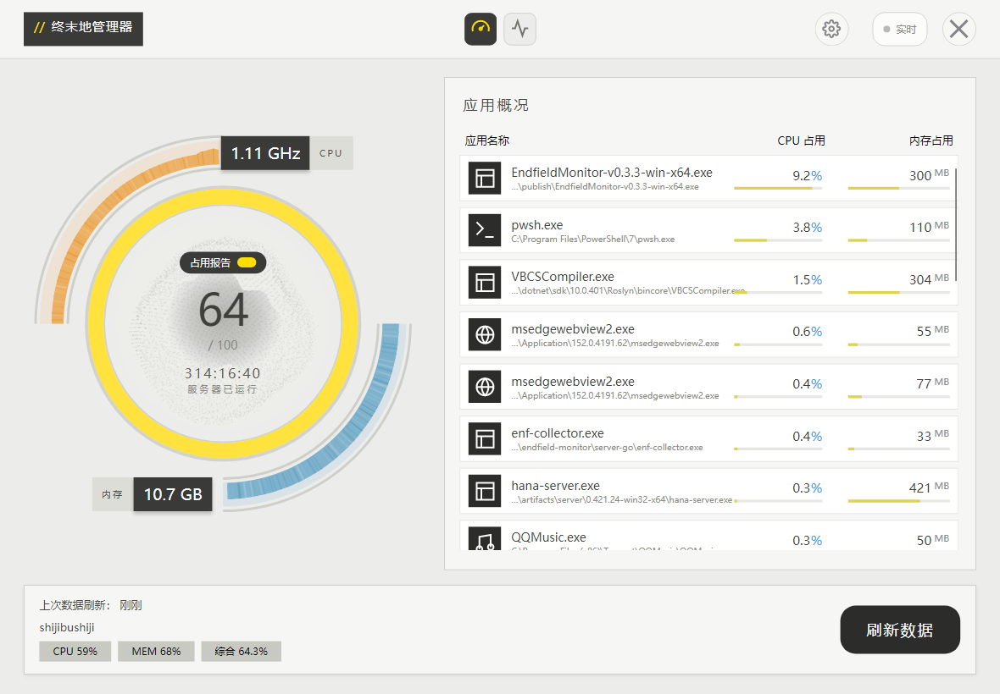
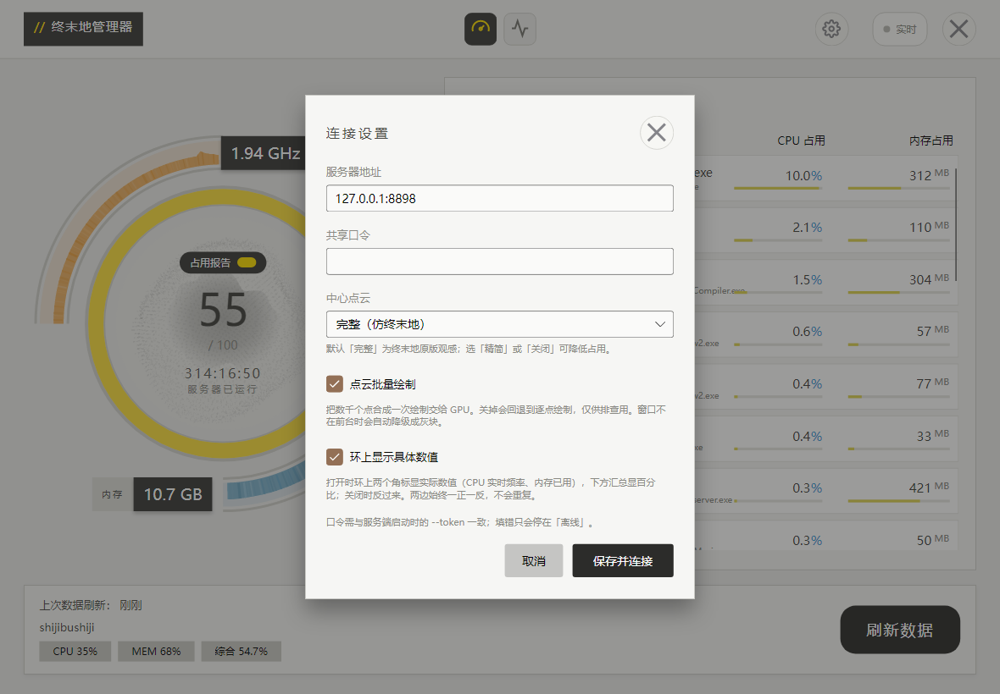

# EnfieldMonitor · 局域网设备监视台

界面风格致敬《明日方舟：终末地》，用来实时查看一台机器的运行状况：局域网里跨机看，
或者就在本机看。不开远程桌面，打开客户端就能看见。



中央是综合占用，四周是各设备的实时读数，右侧列出占用最高的应用——
每行给出进程名、窗口标题与可执行文件路径，用来分辨同名的几个 chrome / python。
点开任意一行还能看型号、频率、显存、电池这些细节。



设置：服务器地址与共享口令，另有中心点云档位、批量绘制、环上显示具体数值三项可调。

被监视的那一端以 **Windows 能力最全**——内存条、磁盘介质、显卡、计划任务这些依赖 WMI 的项都有；
也有 Linux 版，同一份代码交叉编译，但**尚未在真机验证**，上述依赖 WMI 的项会留空。

> 界面设计（配色、电量环、版式、动效语言）参考并致敬 **zmd-manager / 终末地管理器**：
> https://github.com/QinAnze/zmd-manager
>
> 本项目是**独立实现**：客户端用 C# + Avalonia 重写，服务端采集逻辑自行编写，
> 未复制原项目源代码。想复用那套原版界面，请直接前往原项目。

---

## 结构

```
├── src/EndfieldMonitor/        C# / Avalonia 客户端
│   ├── Controls/               自绘控件（电量环、粒子点云、走势图）
│   ├── Models/                 与服务端 JSON 对齐的数据模型
│   ├── Services/               网络层（拉取快照）
│   ├── Theme/                  设计令牌（配色、字体）
│   ├── ViewModels/             视图模型
│   └── Views/                  窗口与页面
├── server-go/                  服务端采集端（Go，只读 HTTP，单文件零依赖）
├── server/collector_server.py  早期 Python 版采集端（已由 Go 版取代，留作参考）
└── reference/                  仅本地研究用的原项目资料，不随仓库分发
```

## 运行原理

```
[被监视的那台]                          [任意一台设备，也可以就是同一台]
enf-collector.exe    ──HTTP/JSON──▶  EnfieldMonitor.exe
(Go, 1s 采样一次)                     (Avalonia 渲染, 1s 轮询)
```

服务端只读、无写操作，向局域网提供一个 `/snapshot` 端点；客户端凭共享口令拉取，
掉线时自动回落演示数据并标记为「离线」。
同机自看时，把地址填成 `127.0.0.1:8898` 即可。

## 服务端部署

服务端是 Go 写的单文件程序，**不需要装任何运行时**。

> 下文里，配置向导与配置文件是跨平台通用的；防火墙规则与开机自启两节是 **Windows 写法**，
> 在 Linux 上得换成对应的做法。

### Linux：一键安装

Ubuntu / Debian 这类用 systemd 的系统，把 `install.sh` 和对应架构的采集端二进制放在同一个目录，
一条命令就完事：装到 `/opt/enf-monitor/`、注册 systemd 服务、开机自启，顺带放行 ufw。

```bash
chmod +x install.sh
sudo ./install.sh                     # 交互式问端口与口令
sudo ./install.sh --port 8898 --token 你的口令 --lite
sudo ./install.sh --plus              # 用增强版（可启停应用、取图标）
sudo ./install.sh --uninstall         # 卸载
```

下面这几节是 Windows 的写法，照着做之前记得换成 Linux 的对应做法。

### 第一步：跑一次配置向导

```powershell
.\enf-collector.exe --setup
```

向导会问监听端口、共享口令、要不要盯一个服务（进程 / 端口 / 计划任务），
把答案写进 exe 同目录的 `enf-collector.json`，并打印出**防火墙规则**和**开机自启命令**，
复制即可用，不用再手抄一长串参数。

以后启动就只引用这个文件：

```powershell
.\enf-collector.exe --config .\enf-collector.json
# --config 可以省略：不给时默认就找 exe 同目录的 enf-collector.json
```

**命令行参数优先级高于配置文件**，临时覆盖很方便：

```powershell
.\enf-collector.exe --config .\enf-collector.json --port 9000
```

### 配置项

配置文件就是一份 JSON，字段与命令行一一对应，用不到的项可以不写：

```json
{
  "host": "0.0.0.0",
  "port": 8898,
  "token": "共享口令",
  "watchName": "麦麦",
  "watchProcs": ["maibot", "napcat"],
  "watchPorts": [6099, 7998, 8765],
  "watchTasks": ["MaiBotStart", "MaiBotMCP", "MaiBot_Daily_Backup"]
}
```

| 配置项 / 参数 | 说明 |
| --- | --- |
| `host` / `--host` | 监听地址，默认 `0.0.0.0`（仅本机调试可写 `127.0.0.1`） |
| `port` / `--port` | 监听端口，默认 `8898` |
| `token` / `--token` | 共享口令；留空则不校验，**只建议本机调试时留空** |
| `watchName` / `--watch-name` | 要盯的服务显示名 |
| `watchProcs` / `--watch-procs` | 进程名关键字，匹配任意一个即算在线 |
| `watchPorts` / `--watch-ports` | 要盯的端口，看是否处于监听 |
| `watchTasks` / `--watch-tasks` | 计划任务名，显示状态与上次运行结果 |
| `lite` / `--lite` | 轻量模式：没人拉快照时自动放慢采样（默认关闭，见下面“采样模式”） |

四个 `watch*` 都不给时，这一块完全不参与采集，客户端只显示机器资源。

### 不用配置文件也行

直接给参数，效果一样：

```powershell
.\enf-collector.exe --port 8898 --token <共享口令> `
  --watch-name 麦麦 --watch-procs maibot,napcat `
  --watch-ports 6099,7998,8765 `
  --watch-tasks MaiBotStart,MaiBotMCP,MaiBot_Daily_Backup
```

### 采样开销

静态信息（CPU 型号、内存条、磁盘型号、显卡）只在启动时取一次，之后全部走原生调用；
其中内存条类型、磁盘介质、显卡型号这几项依赖 WMI，只在 Windows 上取。
进程列表 2 秒一次，计划任务 60 秒一次，主网卡链路速率 60 秒重探一次。
常驻约 30 MB 工作集。

### 采样模式

| 模式 | 行为 | 本机实测（i5-13420H，12 线程） |
| --- | --- | --- |
| 主要（默认） | 不管有没有人在看，都按固定节拍采 | 约 0.3%（单核 3.6%） |
| 轻量（`--lite`） | 30 秒没人拉快照就放慢：进程 30 秒一次、其余 5 秒一次；客户端一来立刻补采 | 有人看时同主要模式；没人看时约 0.035%（单核 0.4%） |

轻量模式完全靠“有没有人访问 `/snapshot`”判断。客户端一拉就唤醒并把节奏拉回去，
所以界面上看不出差别；没人看的时候才真省。切换时会在日志里打一行，方便确认它当前在干什么。

顺带记一笔：全量枚举进程一次要十几到几十毫秒，是采集端最贵的一项。Windows 上没有
更便宜的接口可选，PDH 的 Process 计数器（55 ms）和 Toolhelp 快照（24 ms）都实测过，
都不比 gopsutil（31 ms）快，而后者还只给 pid 和映像名。所以轻量模式压的是**采样频率**，
不是单次成本。

### 增强版（plus）

同一份源码可以编出两个产物：

```powershell
go build -ldflags "-s -w" -o enf-collector.exe .                 # 普通版：只读
go build -tags plus -ldflags "-s -w" -o enf-collector-plus.exe . # 增强版：多出动手能力
```

增强版会在快照里声明 `capabilities`（普通版连这个键都没有），目前带三样：

| 能力 | 端点 | 作用 |
| --- | --- | --- |
| `app.stop` | `GET /app/stop?pid=` | 结束进程，连同它派生的子进程 |
| `app.restart` | `GET /app/restart?pid=` | 用原路径与参数重启 |
| `app.icon` | `GET /app/icon?pid=` | 该进程可执行文件的图标（PNG） |

**安全**：前两个端点要求服务端**必须配了共享口令**（`--token` 或配置文件），否则一律 403；
增强版启动时没配口令会打印警告。取图标只认快照里出现过的 pid，外部传不进任意路径。

客户端探测到 `capabilities` 非空就知道对面是增强版。界面部分还没接。

图标解析不出来时，用 `--probe-icon <pid>` 可以把查找链条上每一步原样打出来，
不常驻也不改任何东西——Linux 上尤其有用（那套目录与匹配规则没在真机核过）。

### 放行防火墙

```powershell
New-NetFirewallRule -DisplayName 'ENF Monitor 8898' -Direction Inbound -Protocol TCP -LocalPort 8898 -Action Allow
```

### 开机自启

`--setup` 会把这段命令打印出来。手写的话，**注意 `-Argument` 里不要再写一遍 exe 路径**，
只放参数；用了配置文件之后，参数就短得多：

```powershell
$exe = 'C:\path\to\enf-collector.exe'
$cfg = 'C:\path\to\enf-collector.json'
$a = New-ScheduledTaskAction -Execute $exe `
     -Argument "--config `"$cfg`"" -WorkingDirectory (Split-Path $exe)
$t = New-ScheduledTaskTrigger -AtStartup
$p = New-ScheduledTaskPrincipal -UserId 'Administrator' -LogonType S4U -RunLevel Highest
Register-ScheduledTask -TaskName 'EnfieldMonitor' -Action $a -Trigger $t -Principal $p
```

## 客户端

三个平台，都是单文件、自带运行时，解压即用：

| 平台 | 文件 |
| --- | --- |
| Windows x64 | `EndfieldMonitor-*-win-x64.exe` |
| Linux x64 | `EndfieldMonitor-*-linux-x64` |
| Linux arm64 | `EndfieldMonitor-*-linux-arm64` |

Windows 上双击即可；Linux 上先给执行权限：

```bash
chmod +x EndfieldMonitor-*-linux-x64
./EndfieldMonitor-*-linux-x64
```

**Linux 上需要桌面环境**（Avalonia 走 X11 或 Wayland，纯服务器跑不起来），
并且建议确认装好了中文字体与常用的 X11 库，否则会看到方块或直接启动失败：

```bash
sudo apt install fonts-noto-cjk
sudo apt install libx11-6 libxrandr2 libxi6 libxcursor1 libxext6 \
                 libxcomposite1 libice6 libsm6 libgl1 libfontconfig1 libfreetype6
```

启动后在设置里填被监视机器的地址与口令即可；**地址留空就默认连本机**（`127.0.0.1:8898`），
同机自看不用填任何东西。

## 构建

一条命令编出全部九个产物（客户端三平台 + 采集端普通/增强各三平台）到 `dist/`：

```powershell
.\build.ps1                    # 版本取最近一个 git tag
.\build.ps1 -Version v0.5.0    # 指定版本
.\build.ps1 -Publish           # 构建并全量推到 Gitee 发行版
```

产物统一命名 `<名字>-v<版本>-<平台>-<架构>`：平台只有 `win|linux`，架构只有 `x64|arm64`，
同时自动生成 `SHA256SUMS.txt`。发布需要令牌，从环境变量 `GITEE_TOKEN`（或 `~/.gitee-token`）
读，不会写进仓库。

想单独编某一样，看下面两节。

### 服务端（需要 Go 1.27+，以 go.mod 声明为准）

```powershell
cd server-go
go build -ldflags "-s -w" -o enf-collector.exe .
# -s -w 去掉符号表与调试信息，体积约小三分之一（10.5 MB -> 7.2 MB）

# 交叉编译 Linux 版（发行版里那一份就是这么来的）
$env:GOOS="linux"; $env:GOARCH="amd64"
go build -ldflags "-s -w" -o enf-collector-linux-amd64 .
```

### 客户端（需要 .NET SDK 10）

```powershell
dotnet build src/EndfieldMonitor                     # 调试构建
dotnet publish src/EndfieldMonitor -c Release -r win-x64 --self-contained true `
  -p:PublishSingleFile=true `
  -p:IncludeNativeLibrariesForSelfExtract=true `
  -p:EnableCompressionInSingleFile=true              # 单文件发布，可直接分发
```

最后两个参数**不能省**，否则打出来的不是单文件，而是一个散着一堆 dll 的目录。
（`Avalonia.Templates` 只在用 `dotnet new` 建模板时才需要，编译现有项目不用装。）

## 口令

客户端与服务端用同一个共享口令。口令不对，服务端返回 `401`，客户端只会停在「离线」。
客户端内可修改服务器地址与口令（设置入口在顶栏）。地址填 `主机:端口` 即可，
手滑带上 `http://` 或结尾斜杠也没关系，会被自动剥掉。

---

## 协议

待定。

原项目 **zmd-manager 未附许可证文件**，按默认版权规则属「保留所有权利」；
本项目与其为「风格致敬、独立实现」的关系，不包含其源代码。
